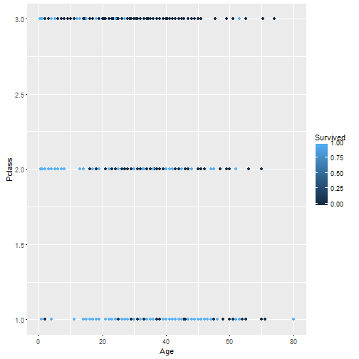

## Goals

1. This project is using to have a slightly look into titanic data about different kinds of people survived.
2. This project also are used to pracice about input and output
3. Some of this project are cited from this link https://github.com/diogoaurelio/titanicShinyApp

--- .class #id 

## Introduction to my shinny apps

1.This app have some inputs. These inputs decide X-lab and Y-lab and what color means.
2.There are also tables about the data, so you can have a quick look about it.
3.Here is a link to my app. https://alphasue.shinyapps.io/ddpproject/


---
## A picture
In the mainpanel, you can see a picture about the relationship among age, pclass and survive

```r
trainData<-read.csv("train.csv")
library(ggplot2)
p<-ggplot(trainData,aes(x=Age,y=Pclass,color=Survived))+geom_point()
print(p)
```

```
## Warning: Removed 177 rows containing missing values (geom_point).
```



---

## Conclusion

#### From this picture and data model, we can find that a better class of ship have a better survive rate.


